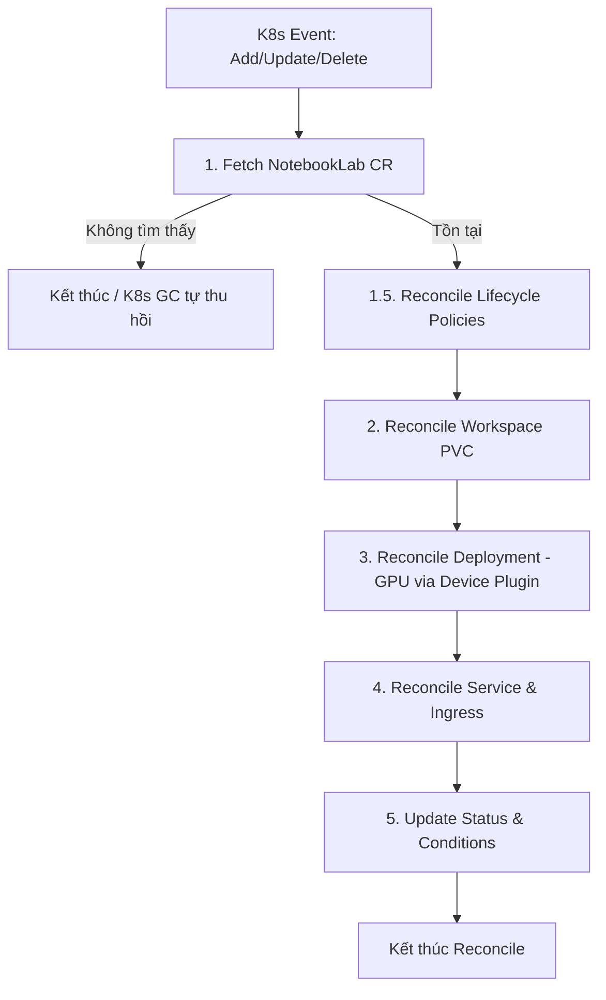
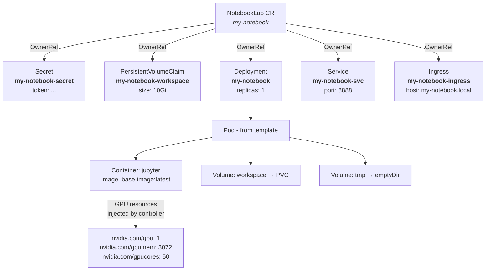

# Kiến trúc `NotebookLab` (Notebook Operator)

## 1. Thiết kế API (API Design)

`NotebookLab` là một Custom Resource Definition (CRD) thuộc API Group `lab.ngtukien.id.vn/v1alpha1`, cung cấp giao diện khai báo chuẩn Kubernetes cho người dùng cuối và hệ thống Nền tảng (Platform Service).

### 1.1. Định nghĩa Spec (Desired State)
Đây là trạng thái mong muốn do người dùng (hoặc Frontend/Backend của nền tảng) gửi xuống Kubernetes API:

```yaml
apiVersion: lab.ngtukien.id.vn/v1alpha1
kind: NotebookLab
metadata:
  name: notebooklab-sample
  labels:
    UserID: "1"
    ProjectID: "1"
spec:
  # Số lượng bản sao (Dùng để Tạm dừng / Tiếp tục). 
  # Mặc định = 1. Khi replicas = 0, Operator thu hồi Pod/GPU nhưng giữ nguyên PVC Workspace.
  replicas: 1
  image: "jupyter/scipy-notebook:latest"
  
  # Cấu hình vòng đời và thu hồi tự động
  lifecycle:
    idleTimeoutMinutes: 60    # Sau 60p không chạy code -> tự động set replicas = 0 (Giữ PVC)
    maxLifespanHours: 12      # Hard limit: Ép tắt phiên làm việc sau 12h
    purgeAfterInactiveDays: 7  # Dọn rác triệt để: Xóa hoàn toàn PVC & CRD sau 7 ngày không quay lại
    
  # Hỗ trợ kéo Image từ Private Registry
  imagePullSecrets:
    - name: "my-private-registry-secret"

  # Chuẩn hóa theo corev1.ResourceRequirements của K8s
  resources:
    requests:
      cpu: "2"
      memory: "2Gi"
    limits:
      cpu: "4"
      memory: "4Gi"
      
  # Chọn loại Node hoặc cấu hình điều phối phần cứng
  nodeSelector:
    gpu-type: "a100"

  # Cấu hình Tolerations để schedule Pod lên các node có Taint đặc thù
  tolerations:
    - key: "nvidia.com/gpu"
      operator: "Exists"
      effect: "NoSchedule"

  # Cấu hình GPU (Hỗ trợ HAMi vGPU / MIG qua Device Plugin)
  gpu: 
    enable: true
    type: "hami"       # "hami" (default) hoặc "mig"
    hami:
      cores: 20       
      memory: "16Gi" 
    # mig:
    #   profile: "1g.5gb"  # Cho mode MIG

  # Cấu hình lưu trữ linh hoạt (Storage Architecture)
  storage:
    # Workspace cá nhân (Read-Write Persistent Volume) - Giữ nguyên khi replicas = 0
    workspace:
      size: "10Gi"
      storageClassName: "local-path" 
      mountPath: "/workspace"

    # Thư mục tạm ephemeral (/tmp emptyDir) - Cần thiết khi chạy Security Hardening (Non-Root)
    tmp:
      sizeLimit: "5Gi"
      mountPath: "/tmp"
    
    # Danh sách các Dataset dùng chung (Read-only PVCs)
    datasets:
      - name: "imagenet-2012"
        pvcName: "shared-imagenet-pvc"
        mountPath: "/datasets/imagenet"
```

### 1.2. Trạng thái trả về (Status / Observed State)
Là kết quả do Controller thu thập từ cụm và cập nhật liên tục:

```yaml
status:
  # Trạng thái tổng thể của Notebook:
  # - Provisioning: Đang cấp phát PVC/Secret/Pod
  # - Running: Pod đang chạy, Security Hardening OK, GPU đã gắn, đã có Access URL
  # - Pausing: Đang trong quá trình tắt Pod để thu hồi tài nguyên GPU/CPU
  # - Paused: Pod đã tắt, GPU đã thu hồi, Workspace PVC giữ nguyên
  # - Failed: Lỗi cấp phát (Lỗi đĩa, sai cấu hình, hết tài nguyên cụm...)
  phase: "Running"

  # Tên Pod thực tế dưới Kubernetes
  podName: "notebooklab-sample-7445494f44-x89zk"

  # Tên PVC lưu trữ Workspace
  pvcName: "notebooklab-sample-workspace-pvc"

  # Access URL chứa JupyterLab token bảo mật
  accessUrl: "https://notebooklab-sample.lab.ngtukien.id.vn"

  # Quản lý vòng đời (Countdown UI)
  lastActiveTime: "2026-08-04T12:00:00Z"
  expiresAt: "2026-08-04T13:00:00Z"

  # Node thực thi
  nodeName: "gpu-worker-01"

  # Báo cáo tình trạng GPU thực tế
  gpuStatus:
    allocated: true
    type: "hami"
    coresAllocated: 20
    memoryAllocated: "16Gi"

  # Standard K8s Conditions (Báo lỗi chi tiết khi Phase == Failed)
  conditions:
    - type: "Ready"
      status: "True"
      lastTransitionTime: "2026-08-04T12:00:00Z"
      reason: "PodRunningAndIngressReady"
      message: "Notebook is ready to accept secure connections"
```

---

## 2. Chuẩn Bảo mật & Pod Hardening (Security Standards)

Notebook Operator tuân thủ nghiêm ngặt các quy tắc bảo mật **Least Privilege & Security Hardening** cho Kubernetes Pod:

1. **Pod SecurityContext**:
   - `runAsNonRoot: true`: Ép container **không được** thực thi với quyền Root (UID 0).
   - `runAsUser: 1000` / `runAsGroup: 1000`: Container chạy dưới ID người dùng `1000`.
   - `fsGroup: 1000`: Tự động phân quyền các volume mount cho GID `1000`.
   - `seccompProfile: { type: RuntimeDefault }`: Kích hoạt bộ lọc syscall mặc định của K8s/Docker.
2. **Container SecurityContext**:
   - `allowPrivilegeEscalation: false`: Chống leo leo quyền (SUID/SGID exploits).
   - `capabilities: { drop: ["ALL"] }`: Thu hồi toàn bộ Linux Capabilities nguy hại (`CAP_SYS_ADMIN`, `CAP_NET_ADMIN`...).
3. **Identity & ServiceAccount Security**:
   - `automountServiceAccountToken: false`: Không tự động mount K8s Service Account Token vào Pod, triệt tiêu nguy cơ container bị chiếm quyền để truy vấn K8s API Server.
4. **Secret Management**:
   - Token JupyterLab được tự động tạo ngẫu nhiên và lưu an toàn trong `Secret` (`<name>-secret`), sau đó tiêm vào Pod thông qua `SecretKeyRef` (không nạp token plaintext dưới dạng biến môi trường cứng).
5. **Ephemeral `/tmp` Storage**:
   - Khi chạy ở chế độ Non-Root, root filesystem `/` bị hạn chế ghi. Controller tự động mount một ổ `emptyDir` vào `/tmp` (tùy chỉnh được `sizeLimit` & `mountPath` qua `storage.tmp`) giúp Python/JupyterLab ghi cache/file tạm hoạt động trơn tru.

---

## 3. Ma trận tài nguyên (Resources Matrix)

`NotebookLab` đóng vai trò là tài nguyên chủ (**Owner Resource**). Các tài nguyên con (**Owned Resources**) do Controller quản lý tự động thông qua `OwnerReference` bao gồm:

| Tài nguyên (Resource) | Loại | Chức năng trong hệ thống |
| ------------------- | ---- | ---------------------- |
| **Secret** | `<name>-secret` | Lưu trữ bảo mật token truy cập của JupyterLab. |
| **PersistentVolumeClaim (PVC)** | `<name>-workspace-pvc` | Cung cấp lưu trữ Workspace bền vững (Read-Write) cho người dùng. |
| **Deployment** | `<name>` | Quản lý Pod JupyterLab. Hỗ trợ Pause/Resume (`replicas: 0/1`) và tự khôi phục (Auto-healing). |
| **Service** | `<name>-service` | Phơi bày port 8888 của Jupyter Container nội bộ cluster. |
| **Ingress** | `<name>-ingress` | Cấp tên miền HTTPS định tuyến từ ngoài Internet vào Service. |

---

## 4. Luồng xử lý Controller (Reconciliation Flow)

Mỗi khi nhận sự kiện (Add / Update / Delete) hoặc khi tài nguyên con bị tác động, hàm `Reconcile` được kích hoạt theo chu trình sau:



### Các bước điều hòa cụ thể:
1. **Fetch Instance**: Lấy thông tin mới nhất từ API Server. Nếu CR đã bị xóa, K8s Garbage Collector sẽ dọn dẹp toàn bộ tài nguyên con theo `OwnerReference`.
1.5. **Reconcile Lifecycle**: Kiểm tra Idle Timeout, Max Lifespan, và Auto-Purge policies.
2. **Reconcile Workspace PVC**: Cấp phát PVC Workspace cá nhân nếu chưa tồn tại. **PVC tuyệt đối không bị xóa khi Pause Pod**.
3. **Reconcile Deployment (Patch)** — bao gồm GPU injection:
   - Xây dựng PodSpec với đầy đủ PodSecurityContext, ContainerSecurityContext, automountServiceAccountToken = false, volume mounts `/tmp`.
   - **GPU injection qua Device Plugin**: Dựa vào `gpu.type`, inject extended resource limits vào container:
     - `hami` → `nvidia.com/gpu=1` + `nvidia.com/gpumem` + `nvidia.com/gpucores`
     - `mig` → `nvidia.com/mig-<profile>=1`
   - Áp dụng kỹ thuật `client.MergeFrom` để thực hiện `r.Patch` (thay vì `r.Update`) giúp cập nhật an toàn `Replicas` & `Template` mà không vi phạm lỗi *immutable fields* trên API Server.
4. **Reconcile Networking**: Cấu hình `Service` (port 8888) và `Ingress` định tuyến domain.
5. **Status Update & Error Handling**: Cập nhật `Status.Phase` (Provisioning, Running, Paused, Failed) và ghi nhận lỗi vào `Conditions` theo chuẩn Kubernetes.

---

## 5. Ràng buộc Kỹ thuật & Lưu ý Quan trọng (Constraints & Production Gotchas)

### 📌 1. Cập nhật Deployment phải dùng `client.MergeFrom` Patch
- **Vấn đề**: Trong Kubernetes, một số trường của Deployment Spec là bất biến (*Immutable*) sau khi khởi tạo (ví dụ: `LabelSelector`). Việc gán đè `existingDeploy.Spec = deploy.Spec` rồi gọi `r.Update` dễ gây lỗi `Update failed: field is immutable` do API Server tự động mutate các default values.
- **Giải pháp**: Luôn dùng bản vá `patch := client.MergeFrom(existingDeploy.DeepCopy())` và chỉ cập nhật các trường biến động (`existingDeploy.Spec.Replicas = deploy.Spec.Replicas`, `existingDeploy.Spec.Template = deploy.Spec.Template`) rồi gọi `r.Patch`.

### 📌 2. Phân quyền File System khi chạy Non-Root
- **Vấn đề**: Khi ép `runAsNonRoot: true` và `runAsUser: 1000`, container không có quyền tạo file tạm tại `/tmp` trên root filesystem.
- **Giải pháp**: Luôn mount volume `emptyDir` vào `/tmp` (cho phép tùy chỉnh `storage.tmp.sizeLimit` và `storage.tmp.mountPath`) và cấu hình `fsGroup: 1000` trong `PodSecurityContext`.

### 📌 3. Tự phục hồi tự động (Auto-healing)
- Controller đăng ký theo dõi tất cả tài nguyên con trong `SetupWithManager` via `.Owns()` (Secret, PVC, Deployment, Service, Ingress).
- Nếu bất kỳ tài nguyên con nào bị người quản trị xóa nhầm bằng `kubectl delete`, Operator sẽ lập tức nhận được Event và tái tạo lại tài nguyên đó ngay lập tức mà không làm gián đoạn hệ thống.

### 📌 4. GPU Security khi dùng Device Plugin
- **Vấn đề**: Khi GPU enabled, NVIDIA runtime cần inject device nodes vào container, yêu cầu `allowPrivilegeEscalation: true`.
- **Giải pháp**: Controller tự động nới lỏng `SecurityContext` cho GPU containers (bỏ `allowPrivilegeEscalation: false` và `capabilities.drop: ALL`) trong khi vẫn giữ `runAsNonRoot` và `fsGroup`.

### 📌 5. Token Format cho Production
- **Hiện tại**: Token được sinh theo pattern `<name>-token-sec` (đủ cho dev/test).
- **Production (Web)**: Khi tích hợp với Backend/Frontend, token nên được sinh theo format `<userId>-<notebookName>` để đảm bảo tính duy nhất và có thể audit theo user. Backend service sẽ truyền thông tin này qua labels `UserID` trên CR.

---

## 6. Tài nguyên được sinh ra từ CRD (Generated Resources)

Khi tạo 1 `NotebookLab` CR, Controller reconcile và sinh ra **5 tài nguyên K8s** con, tất cả đều có `OwnerReference` trỏ về CR gốc:



### 6.1. Secret — `<name>-secret`

```yaml
apiVersion: v1
kind: Secret
metadata:
  name: my-notebook-secret          # pattern: <name>-secret
  namespace: default
  ownerReferences: [NotebookLab/my-notebook]
stringData:
  token: "my-notebook-token-sec"    # pattern: <name>-token-sec
  # Production: nên đổi thành <userId>-<notebookName> khi tích hợp web
```

> Dùng để inject `JUPYTER_TOKEN` env var vào container qua `SecretKeyRef`.

### 6.2. PersistentVolumeClaim — `<name>-workspace`

```yaml
apiVersion: v1
kind: PersistentVolumeClaim
metadata:
  name: my-notebook-workspace       # pattern: <name>-workspace
  namespace: default
  ownerReferences: [NotebookLab/my-notebook]
spec:
  accessModes: [ReadWriteOnce]
  storageClassName: local-path       # từ spec.storage.workspace.storageClassName
  resources:
    requests:
      storage: 10Gi                  # từ spec.storage.workspace.size
```

> **Không bị xóa khi pause** (replicas=0). Chỉ bị xóa khi auto-purge hoặc xóa CR.

### 6.3. Deployment — `<name>`

```yaml
apiVersion: apps/v1
kind: Deployment
metadata:
  name: my-notebook                  # pattern: <name>
  namespace: default
  ownerReferences: [NotebookLab/my-notebook]
spec:
  replicas: 1                        # từ spec.replicas (0 = paused)
  selector:
    matchLabels:
      app: my-notebook
  template:
    metadata:
      labels:
        app: my-notebook
    spec:
      automountServiceAccountToken: false
      securityContext:
        runAsNonRoot: true
        runAsUser: 1000
        runAsGroup: 1000
        fsGroup: 1000
        seccompProfile: { type: RuntimeDefault }
      containers:
        - name: jupyter
          image: ghcr.io/ngtukien/notebook-operator/base-image:latest
          securityContext:            # Nới lỏng cho GPU container
            allowPrivilegeEscalation: true
          env:
            - name: JUPYTER_TOKEN
              valueFrom:
                secretKeyRef:
                  name: my-notebook-secret
                  key: token
          resources:
            requests:
              cpu: "2"
              memory: 4Gi
            limits:
              cpu: "4"
              memory: 8Gi
              # ↓↓↓ INJECTED BY CONTROLLER (Device Plugin) ↓↓↓
              nvidia.com/gpu: "1"
              nvidia.com/gpumem: "3072"     # 3Gi = 3072 MiB
              nvidia.com/gpucores: "50"
          volumeMounts:
            - name: workspace
              mountPath: /workspace
            - name: tmp
              mountPath: /tmp
      volumes:
        - name: workspace
          persistentVolumeClaim:
            claimName: my-notebook-workspace
        - name: tmp
          emptyDir:
            sizeLimit: 2Gi
      nodeSelector:
        gpu: "on"
      tolerations:
        - key: nvidia.com/gpu
          operator: Exists
          effect: NoSchedule
```

> GPU resource limits (`nvidia.com/gpu`, `nvidia.com/gpumem`, `nvidia.com/gpucores`) được **controller inject tự động** dựa trên `spec.gpu`. User **không cần** set chúng trong `spec.resources.limits`.

### 6.4. Service — `<name>-svc`

```yaml
apiVersion: v1
kind: Service
metadata:
  name: my-notebook-svc              # pattern: <name>-svc
  namespace: default
  ownerReferences: [NotebookLab/my-notebook]
spec:
  selector:
    app: my-notebook
  ports:
    - name: http
      port: 8888
```

### 6.5. Ingress — `<name>-ingress`

```yaml
apiVersion: networking.k8s.io/v1
kind: Ingress
metadata:
  name: my-notebook-ingress          # pattern: <name>-ingress
  namespace: default
  ownerReferences: [NotebookLab/my-notebook]
  annotations:
    nginx.ingress.kubernetes.io/proxy-read-timeout: "3600"
    nginx.ingress.kubernetes.io/proxy-send-timeout: "3600"
    nginx.ingress.kubernetes.io/websocket-services: my-notebook-svc
spec:
  rules:
    - host: my-notebook.local        # pattern: <name>.local
      http:
        paths:
          - path: /
            pathType: Prefix
            backend:
              service:
                name: my-notebook-svc
                port:
                  number: 8888
```

### 6.6. GPU Resource Injection (Device Plugin)

Tùy vào `spec.gpu.type`, controller inject các extended resources khác nhau vào `container.resources.limits`:

| `gpu.type` | Resources được inject | Nguồn cấu hình |
|---|---|---|
| `hami` (default) | `nvidia.com/gpu: 1` | Luôn luôn |
| | `nvidia.com/gpumem: <MiB>` | `gpu.hami.memory` (3Gi → 3072) |
| | `nvidia.com/gpucores: <N>` | `gpu.hami.cores` |
| `mig` | `nvidia.com/mig-<profile>: 1` | `gpu.mig.profile` (vd: `1g.5gb`) |

### 6.7. Naming Convention

| Resource | Name Pattern | Ví dụ (name=`my-notebook`) |
|---|---|---|
| Secret | `<name>-secret` | `my-notebook-secret` |
| PVC | `<name>-workspace` | `my-notebook-workspace` |
| Deployment | `<name>` | `my-notebook` |
| Service | `<name>-svc` | `my-notebook-svc` |
| Ingress | `<name>-ingress` | `my-notebook-ingress` |
| AccessURL | `https://<name>.local/lab?token=<token>` | `https://my-notebook.local/lab?token=...` |
