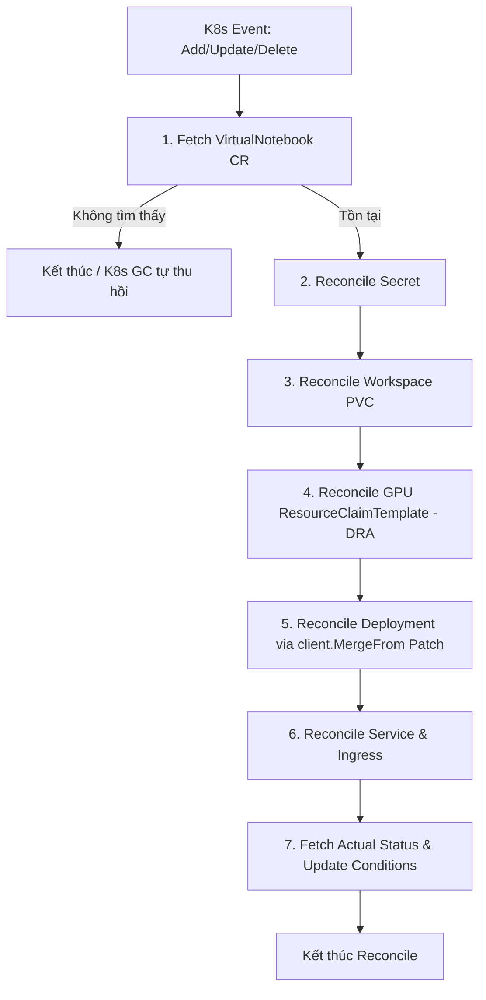

# Kiến trúc `VirtualNotebook` (Jupiter Operator)

## 1. Thiết kế API (API Design)

`VirtualNotebook` là một Custom Resource Definition (CRD) thuộc API Group `lab.ngtukien.id.vn/v1alpha1`, cung cấp giao diện khai báo chuẩn Kubernetes cho người dùng cuối và hệ thống Nền tảng (Platform Service).

### 1.1. Định nghĩa Spec (Desired State)
Đây là trạng thái mong muốn do người dùng (hoặc Frontend/Backend của nền tảng) gửi xuống Kubernetes API:

```yaml
apiVersion: lab.ngtukien.id.vn/v1alpha1
kind: VirtualNotebook
metadata:
  name: virtualnotebook-sample
  labels:
    UserID: "1"
    ProjectID: "1"
spec:
  # Số lượng bản sao (Dùng để Tạm dừng / Tiếp tục). 
  # Mặc định = 1. Khi replicas = 0, Operator thu hồi Pod/GPU nhưng giữ nguyên PVC Workspace.
  replicas: 1
  image: "jupyter/scipy-notebook:latest"
  
  # Cấu hình vòng đời và thu hồi tự động
  lifecycle:
    idleTimeoutMinutes: 60    # Sau 60p không chạy code -> tự động set replicas = 0 (Giữ PVC)
    maxLifespanHours: 12      # Hard limit: Ép tắt phiên làm việc sau 12h
    purgeAfterInactiveDays: 7  # Dọn rác triệt để: Xóa hoàn toàn PVC & CRD sau 7 ngày không quay lại
    
  # Hỗ trợ kéo Image từ Private Registry
  imagePullSecrets:
    - name: "my-private-registry-secret"

  # Chuẩn hóa theo corev1.ResourceRequirements của K8s
  resources:
    requests:
      cpu: "2"
      memory: "2Gi"
    limits:
      cpu: "4"
      memory: "4Gi"
      
  # Chọn loại Node hoặc cấu hình điều phối phần cứng
  nodeSelector:
    gpu-type: "a100"

  # Cấu hình Tolerations để schedule Pod lên các node có Taint đặc thù
  tolerations:
    - key: "nvidia.com/gpu"
      operator: "Exists"
      effect: "NoSchedule"

  # Cấu hình GPU (Hỗ trợ HAMi vGPU / MIG)
  gpu: 
    enable: true
    type: "hami" 
    hami:
      cores: 20       
      memory: "16Gi" 

  # Cấu hình lưu trữ linh hoạt (Storage Architecture)
  storage:
    # Workspace cá nhân (Read-Write Persistent Volume) - Giữ nguyên khi replicas = 0
    workspace:
      size: "10Gi"
      storageClassName: "local-path" 
      mountPath: "/workspace"

    # Thư mục tạm ephemeral (/tmp emptyDir) - Cần thiết khi chạy Security Hardening (Non-Root)
    tmp:
      sizeLimit: "5Gi"
      mountPath: "/tmp"
    
    # Danh sách các Dataset dùng chung (Read-only PVCs)
    datasets:
      - name: "imagenet-2012"
        pvcName: "shared-imagenet-pvc"
        mountPath: "/datasets/imagenet"
```

### 1.2. Trạng thái trả về (Status / Observed State)
Là kết quả do Controller thu thập từ cụm và cập nhật liên tục:

```yaml
status:
  # Trạng thái tổng thể của Notebook:
  # - Provisioning: Đang cấp phát PVC/Secret/ResourceClaimTemplate/Pod
  # - Running: Pod đang chạy, Security Hardening OK, GPU đã gắn, đã có Access URL
  # - Pausing: Đang trong quá trình tắt Pod để thu hồi tài nguyên GPU/CPU
  # - Paused: Pod đã tắt, GPU đã thu hồi, Workspace PVC giữ nguyên
  # - Failed: Lỗi cấp phát (Lỗi đĩa, sai cấu hình, hết tài nguyên cụm...)
  phase: "Running"

  # Tên Pod thực tế dưới Kubernetes
  podName: "virtualnotebook-sample-7445494f44-x89zk"

  # Tên PVC lưu trữ Workspace
  pvcName: "virtualnotebook-sample-workspace-pvc"

  # Access URL chứa JupyterLab token bảo mật
  accessUrl: "https://virtualnotebook-sample.lab.ngtukien.id.vn"

  # Quản lý vòng đời (Countdown UI)
  lastActiveTime: "2026-08-04T12:00:00Z"
  expiresAt: "2026-08-04T13:00:00Z"

  # Node thực thi
  nodeName: "gpu-worker-01"

  # Báo cáo tình trạng GPU thực tế
  gpuStatus:
    allocated: true
    type: "hami"
    coresAllocated: 20
    memoryAllocated: "16Gi"

  # Standard K8s Conditions (Báo lỗi chi tiết khi Phase == Failed)
  conditions:
    - type: "Ready"
      status: "True"
      lastTransitionTime: "2026-08-04T12:00:00Z"
      reason: "PodRunningAndIngressReady"
      message: "Notebook is ready to accept secure connections"
```

---

## 2. Chuẩn Bảo mật & Pod Hardening (Security Standards)

Jupiter Operator tuân thủ nghiêm ngặt các quy tắc bảo mật **Least Privilege & Security Hardening** cho Kubernetes Pod:

1. **Pod SecurityContext**:
   - `runAsNonRoot: true`: Ép container **không được** thực thi với quyền Root (UID 0).
   - `runAsUser: 1000` / `runAsGroup: 1000`: Container chạy dưới ID người dùng `1000`.
   - `fsGroup: 1000`: Tự động phân quyền các volume mount cho GID `1000`.
   - `seccompProfile: { type: RuntimeDefault }`: Kích hoạt bộ lọc syscall mặc định của K8s/Docker.
2. **Container SecurityContext**:
   - `allowPrivilegeEscalation: false`: Chống leo leo quyền (SUID/SGID exploits).
   - `capabilities: { drop: ["ALL"] }`: Thu hồi toàn bộ Linux Capabilities nguy hại (`CAP_SYS_ADMIN`, `CAP_NET_ADMIN`...).
3. **Identity & ServiceAccount Security**:
   - `automountServiceAccountToken: false`: Không tự động mount K8s Service Account Token vào Pod, triệt tiêu nguy cơ container bị chiếm quyền để truy vấn K8s API Server.
4. **Secret Management**:
   - Token JupyterLab được tự động tạo ngẫu nhiên và lưu an toàn trong `Secret` (`<name>-secret`), sau đó tiêm vào Pod thông qua `SecretKeyRef` (không nạp token plaintext dưới dạng biến môi trường cứng).
5. **Ephemeral `/tmp` Storage**:
   - Khi chạy ở chế độ Non-Root, root filesystem `/` bị hạn chế ghi. Controller tự động mount một ổ `emptyDir` vào `/tmp` (tùy chỉnh được `sizeLimit` & `mountPath` qua `storage.tmp`) giúp Python/JupyterLab ghi cache/file tạm hoạt động trơn tru.

---

## 3. Ma trận tài nguyên (Resources Matrix)

`VirtualNotebook` đóng vai trò là tài nguyên chủ (**Owner Resource**). Các tài nguyên con (**Owned Resources**) do Controller quản lý tự động thông qua `OwnerReference` bao gồm:

| Tài nguyên (Resource) | Loại | Chức năng trong hệ thống |
| ------------------- | ---- | ---------------------- |
| **Secret** | `<name>-secret` | Lưu trữ bảo mật token truy cập của JupyterLab. |
| **PersistentVolumeClaim (PVC)** | `<name>-workspace-pvc` | Cung cấp lưu trữ Workspace bền vững (Read-Write) cho người dùng. |
| **ResourceClaimTemplate** | `<name>-gpu-template` | Quản lý mẫu tài nguyên GPU cho cơ chế K8s Dynamic Resource Allocation (DRA). |
| **Deployment** | `<name>` | Quản lý Pod JupyterLab. Hỗ trợ Pause/Resume (`replicas: 0/1`) và tự khôi phục (Auto-healing). |
| **Service** | `<name>-service` | Phơi bày port 8888 của Jupyter Container nội bộ cluster. |
| **Ingress** | `<name>-ingress` | Cấp tên miền HTTPS định tuyến từ ngoài Internet vào Service. |

---

## 4. Luồng xử lý Controller (Reconciliation Flow)

Mỗi khi nhận sự kiện (Add / Update / Delete) hoặc khi tài nguyên con bị tác động, hàm `Reconcile` được kích hoạt theo chu trình sau:



### Các bước điều hòa cụ thể:
1. **Fetch Instance**: Lấy thông tin mới nhất từ API Server. Nếu CR đã bị xóa, K8s Garbage Collector sẽ dọn dẹp toàn bộ tài nguyên con theo `OwnerReference`.
2. **Reconcile Secret**: Kiểm tra và tự động sinh ngẫu nhiên Token bảo mật nếu chưa có Secret `<name>-secret`.
3. **Reconcile Workspace PVC**: Cấp phát PVC Workspace cá nhân nếu chưa tồn tại. **PVC tuyệt đối không bị xóa khi Pause Pod**.
4. **Reconcile GPU DRA Template**: Nếu GPU enable, khởi tạo/cập nhật `ResourceClaimTemplate` cho K8s DRA Scheduler.
5. **Reconcile Deployment (Patch)**:
   - Xây dựng PodSpec với đầy đủ PodSecurityContext, ContainerSecurityContext, automountServiceAccountToken = false, volume mounts `/tmp`.
   - Áp dụng kỹ thuật `client.MergeFrom` để thực hiện `r.Patch` (thay vì `r.Update`) giúp cập nhật an toàn `Replicas` & `Template` mà không vi phạm lỗi *immutable fields* trên API Server.
6. **Reconcile Networking**: Cấu hình `Service` (port 8888) và `Ingress` định tuyến domain.
7. **Status Update & Error Handling**: Cập nhật `Status.Phase` (Provisioning, Running, Paused, Failed) và ghi nhận lỗi vào `Conditions` theo chuẩn Kubernetes.

---

## 5. Ràng buộc Kỹ thuật & Lưu ý Quan trọng (Constraints & Production Gotchas)

### 📌 1. Cập nhật Deployment phải dùng `client.MergeFrom` Patch
- **Vấn đề**: Trong Kubernetes, một số trường của Deployment Spec là bất biến (*Immutable*) sau khi khởi tạo (ví dụ: `LabelSelector`). Việc gán đè `existingDeploy.Spec = deploy.Spec` rồi gọi `r.Update` dễ gây lỗi `Update failed: field is immutable` do API Server tự động mutate các default values.
- **Giải pháp**: Luôn dùng bản vá `patch := client.MergeFrom(existingDeploy.DeepCopy())` và chỉ cập nhật các trường biến động (`existingDeploy.Spec.Replicas = deploy.Spec.Replicas`, `existingDeploy.Spec.Template = deploy.Spec.Template`) rồi gọi `r.Patch`.

### 📌 2. Độc lập ResourceClaim trong Deployment (DRA Problem)
- **Vấn đề**: Tạo trực tiếp `ResourceClaim` độc lập và gắn vào Deployment sẽ khiến Pod kẹt trạng thái `Pending` khi rollout/scale vì `ResourceClaim` trực tiếp chỉ gắn được với 1 Pod duy nhất tại một thời điểm (Single Pod Binding).
- **Giải pháp**: Phải sử dụng `ResourceClaimTemplate`. K8s Scheduler sẽ tự động sinh ra một `ResourceClaim` riêng biệt tương ứng với từng instance Pod được tạo ra bởi Deployment Controller.

### 📌 3. Phân quyền File System khi chạy Non-Root
- **Vấn đề**: Khi ép `runAsNonRoot: true` và `runAsUser: 1000`, container không có quyền tạo file tạm tại `/tmp` trên root filesystem.
- **Giải pháp**: Luôn mount volume `emptyDir` vào `/tmp` (cho phép tùy chỉnh `storage.tmp.sizeLimit` và `storage.tmp.mountPath`) và cấu hình `fsGroup: 1000` trong `PodSecurityContext`.

### 📌 4. Tự phục hồi tự động (Auto-healing)
- Controller đăng ký theo dõi tất cả tài nguyên con trong `SetupWithManager` via `.Owns()` (Secret, PVC, ResourceClaimTemplate, Deployment, Service, Ingress).
- Nếu bất kỳ tài nguyên con nào bị người quản trị xóa nhầm bằng `kubectl delete`, Operator sẽ lập tức nhận được Event và tái tạo lại tài nguyên đó ngay lập tức mà không làm gián đoạn hệ thống.
