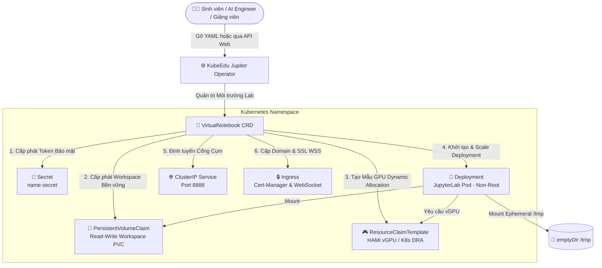

# 🚀 KubeEdu Jupiter Operator — Cloud-Native AI/ML & Jupyter Notebook Lab Platform

    

**KubeEdu Jupiter Operator** là bộ điều khiển Kubernetes Operator tiêu chuẩn doanh nghiệp thuộc hệ sinh thái **KubeEdu**, chuyên tự động hóa việc khởi tạo, quản trị vòng đời và phân phối môi trường phòng thí nghiệm AI/ML & Jupyter Notebook (Cloud-Native Interactive Lab Platform) trên hạ tầng điện toán đám mây.

Hệ thống được thiết kế tối ưu cho các khóa học Trí tuệ nhân tạo (AI/ML), Khai phá dữ liệu (Data Science) và Học máy tại các Trường đại học cũng như Doanh nghiệp, hỗ trợ tăng tốc phần cứng **NVIDIA GPU (HAMi vGPU / MIG / DRA)**, bảo mật siết chặt **Pod Hardening (Non-Root)**, lưu trữ dữ liệu bền vững và tự động thu hồi tài nguyên thông minh (**Pause/Resume & Idle Timeout**).

---

## 🏛️ Kiến Trúc Hệ Thống & Tài Nguyên Tùy Chỉnh (CRDs)

Hệ thống vận hành dựa trên Custom Resource Definition: **`VirtualNotebook`** thuộc API Group `lab.ngtukien.id.vn/v1alpha1`:



### Key Features của `VirtualNotebook`

1. **Quản lý Vòng đời & Tự động Tắt máy (Lifecycle & Auto-Scaling):**
   * **Tạm dừng / Tiếp tục (Pause/Resume):** Khi đặt `replicas: 0`, Operator lập tức giải phóng hoàn toàn Pod và tài nguyên GPU/CPU đắt đỏ về cho cụm, nhưng **giữ nguyên 100% dữ liệu Workspace PVC** của người dùng.
   * **Tự động thu hồi theo thời gian rảnh (Idle Timeout):** Tự động phát hiện khi Notebook không chạy mã nguồn quá khoảng thời gian cấu hình (`idleTimeoutMinutes`) để đưa `replicas` về `0`.
   * **Thời hạn tối đa (Max Lifespan):** Áp đặt giới hạn thời gian chạy tối đa (`maxLifespanHours`) nhằm tránh lãng phí GPU.

2. **Tăng tốc Phần cứng GPU Linh hoạt (AI/ML Hardware Acceleration):**
   * Tích hợp **HAMi vGPU Scheduler** cho phép phân chia nhỏ vGPU (Cores % và Memory MB/GB) giúp nhiều sinh viên chia sẻ chung 1 card GPU vật lý.
   * Hỗ trợ chuẩn mới **Kubernetes Dynamic Resource Allocation (DRA)** thông qua `ResourceClaimTemplate`.

3. **Bảo mật Siết chặt (Pod Security Hardening):**
   * **Non-Root Execution:** Bắt buộc container chạy dưới UID `1000` (`runAsNonRoot: true`), tước toàn bộ Linux Capabilities (`drop: ["ALL"]`) và cấm leo quyền (`allowPrivilegeEscalation: false`).
   * **Vô hiệu hóa ServiceAccount Token:** Đặt `automountServiceAccountToken: false` để triệt tiêu nguy cơ bị chiếm quyền truy vấn K8s API Server từ bên trong Notebook.
   * **Ghi tạm An toàn với Ephemeral `/tmp`:** Tự động mount ổ `emptyDir` vào `/tmp` giúp các thư viện Python/JupyterLab ghi cache trơn tru ở chế độ Non-Root.

---

## 🏗️ Hướng Dẫn Khởi Tạo Cụm & Cấu Hình GPU/HAMi (Ansible Engine)

Hệ thống trang bị bộ động cơ tự động hóa Ansible (phong cách **Kubespray**) giúp biến các máy chủ thô thành cụm K3s/Kubeadm sẵn sàng chạy GPU và HAMi vGPU.

### Cấu Trúc Thư Mục Ansible (`ansible/`)
```text
ansible/
├── ansible.cfg                    # Cấu hình Ansible tối ưu Pipelining & SSH
├── cluster.yml                    # 🚀 Playbook cài đặt toàn diện Cụm K3s & GPU Engine
├── k3s.yaml                       # Playbook khởi tạo nhanh K3s
├── README.md                      # 📜 Tài liệu hướng dẫn Ansible chi tiết
├── inventory/                     # Quản lý kho máy chủ (Inventory)
│   └── lab-cluster/               
│       ├── hosts.ini              # Danh sách IP Master, Worker & GPU Nodes
│       └── group_vars/            # Biến cấu hình (NVIDIA Toolkit, HAMi, K3s version)
├── molecule/                      # Khung kiểm thử tự động cho Ansible Roles
└── roles/                         # Bộ Roles (common, containerd, k3s, nvidia-container-toolkit, hami-node)
```

### Cách Thực Thi Ansible
```bash
cd ansible
# Cài đặt toàn bộ cụm K3s kèm GPU NVIDIA & HAMi:
ansible-playbook cluster.yml -i inventory/lab-cluster/hosts.ini
```

#### ⚡ Thực thi Zero-Clone (Không cần git clone):
```bash
curl -fsSL https://raw.githubusercontent.com/ngtukien/jupiter-operator/main/ansible/cluster.yml | ansible-playbook -i "localhost," -c local /dev/stdin
```

---

## 🛠️ Hướng Dẫn Phát Triển & Triển Khai Operator

### 1. Yêu cầu Tiền quyết (Prerequisites)
* **Go:** `v1.26.0+`
* **Docker:** `17.03+`
* **Kubernetes Cluster:** `v1.32+` (K3s, Kubeadm hoặc Kind/Envtest)
* **Nvidia Container Toolkit / HAMi vGPU** (Nếu dùng tính năng GPU)

### 2. Kiểm Thử & Linting Mã Nguồn
```bash
# Sửa lỗi lint và định dạng code chuẩn:
make lint-fix

# Sinh lại CRD Manifests và DeepCopy code:
make manifests generate

# Kích hoạt Unit test (Envtest):
make test

# Kích hoạt E2E test trên Cụm Kind:
make test-e2e
```

### 3. Triển khai Operator lên Cụm

#### Cách 1: Triển khai Siêu Tốc qua GitHub Releases (Single-Command Install)
Dành cho Quản trị viên cụm (Admin), tải file phát hành chính thức `install.yaml`:
```bash
kubectl apply -f https://github.com/ngtukien/jupiter-operator/releases/latest/download/install.yaml
```

#### Cách 2: Triển khai dành cho Nhà Phát Triển (Developer Mode)
```bash
# Step 1: Build & Push Docker Image của Operator
export IMG="ghcr.io/ngtukien/jupiter-operator:v1.0.0"
make docker-build docker-push IMG=$IMG

# Step 2: Apply CRDs và Deploy Controller Manager
make install
make deploy IMG=$IMG
```

---

## 📦 Ví Dụ Khai Báo `VirtualNotebook` (Quickstart Sample)

Tạo file `sample-virtualnotebook.yaml`:

```yaml
apiVersion: lab.ngtukien.id.vn/v1alpha1
kind: VirtualNotebook
metadata:
  name: jupyter-ai-lab01
  namespace: default
  labels:
    student_id: "sv-2026-88"
    course: "deep-learning"
spec:
  replicas: 1                             # 1 = Running, 0 = Paused (Thu hồi GPU, giữ PVC)
  image: "jupyter/scipy-notebook:latest"  # Image JupyterLab
  
  # Cấu hình tự động tắt máy
  lifecycle:
    idleTimeoutMinutes: 60                # Tự động pause sau 60 phút không tương tác
    maxLifespanHours: 12                  # Tự động tắt sau 12 tiếng

  # Giới hạn tài nguyên CPU & RAM
  resources:
    requests:
      cpu: "2"
      memory: "4Gi"
    limits:
      cpu: "4"
      memory: "8Gi"

  # Tăng tốc GPU với HAMi vGPU
  gpu:
    enable: true
    type: "hami"
    hami:
      cores: 20                           # Cấp 20% sức mạnh tính toán của 1 core GPU
      memory: "8Gi"                       # Cấp 8GB VRAM

  # Lưu trữ Dữ liệu & Thư mục Tạm
  storage:
    workspace:
      size: "20Gi"
      storageClassName: "local-path"      # PVC Workspace không bị xóa khi Pause
      mountPath: "/workspace"
    tmp:
      sizeLimit: "5Gi"
      mountPath: "/tmp"
    datasets:
      - name: "shared-mnist"
        pvcName: "mnist-dataset-pvc"
        mountPath: "/datasets/mnist"
```

Áp dụng lên cụm: `kubectl apply -f sample-virtualnotebook.yaml`

---

## 🔍 Trạng Thái & Báo Cáo Quan Sát (Observability)

Kiểm tra trạng thái các Notebook đang chạy trên cụm:
```bash
kubectl get virtualnotebook -A -o wide
```

### Các Phase Trạng Thái (`Status.Phase`):
* **`Provisioning`**: Đang cấp phát PVC, Secret, ResourceClaimTemplate và Pod.
* **`Running`**: Pod đã khởi tạo thành công, Security Hardening OK, đã gắn GPU và có Access URL.
* **`Pausing`**: Đang trong quá trình thu hồi Pod để trả GPU về cho cụm.
* **`Paused`**: Pod đã tắt hoàn toàn, GPU đã thu hồi, Workspace PVC được bảo lưu an toàn.
* **`Failed`**: Lỗi cấp phát (Hết tài nguyên cụm, sai cấu hình storage/image...).

---

## 📜 Bản Quyền & Giấy Phép (License)

*Phát triển bởi Đội ngũ Kiến Trúc Sư Hệ Thống — **ToiYeuPTIT Dev & Nguyen Tu Kien** (2026).*  
*Được phát hành dưới các điều khoản của **[Apache License, Version 2.0](LICENSE)**.*
