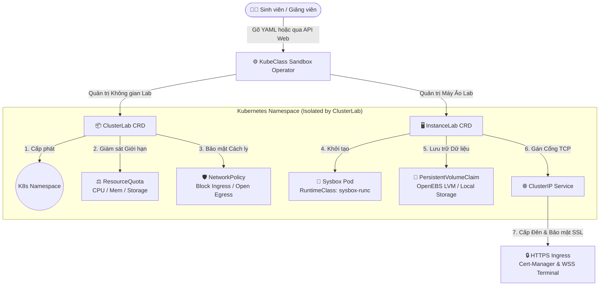

# 🚀 KubeClass Sandbox Operator — Cloud-Native Practical Lab & Sandbox Platform

[](https://github.com/ngtukien/sandbox-operator/actions/workflows/ci.yml) [](https://github.com/ngtukien/sandbox-operator/actions/workflows/release.yml) [](LICENSE)

    

**KubeClass Sandbox Operator** là bộ điều khiển Kubernetes (Kubernetes Operator) tiêu chuẩn doanh nghiệp của hệ sinh thái **KubeClass**, chuyên tự động hóa việc khởi tạo và quản trị nền tảng phòng thí nghiệm & Sandbox (Cloud-Native Lab Platform) trên điện toán đám mây, phục vụ tối ưu cho mục đích đào tạo thực thao (University Practical Labs, Coding Bootcamps, DevSecOps Cyber-Range). 

Hệ thống tích hợp sâu với **Sysbox Runtime** để vận hành các máy ảo Container (System Containers / Docker-in-Docker với đầy đủ `systemd` gốc) ngay bên trong Kubernetes Pod với hiệu năng cao nhạy bén như máy chủ vật lý, hỗ trợ trọn vẹn kết nối Terminal/VSCode qua Web (WebSocket Secure).

---

## 🏛️ Kiến Trúc Hệ Thống & Tài Nguyên Tùy Chỉnh (CRDs)

Hệ thống hoạt động dựa trên 2 thực thể Custom Resources chính:



### 1. `ClusterLab` — Cụm Phòng Lab Độc Lập
* **Cách ly vô song (Multi-Tenant Isolation):** Tự động sinh Kubernetes Namespace chuẩn RFC 1123 đi kèm với **NetworkPolicy** (Mặc định cho phép 100% kết nối Egress để sinh viên thoải mái `docker pull`, `git clone`, `apt install`, nhưng phong tỏa chặt chẽ Ingress để chống rò rỉ dữ liệu hay gian lận thi cử giữa các phòng lab).
* **Quản trị ranh giới tài nguyên (Resource Quotas):** Áp đặt khắt khe giới hạn tối đa CPU, RAM, Storage và số lượng Object thông qua bộ chuẩn `resource.Quantity` chính quy của Kubernetes.
* **Quy tắc Finalizer-First & Hết hạn thông minh (TTL Anti-Drift):** Cam kết đảm bảo dọn sạch sẽ tài nguyên khi xóa cụm thông qua OwnerReferences và tự động giải tán phòng Lab sau thời gian quy định (`ttl` như `4h`, `120m`) nhằm chống ùn đọng rác trên Cluster.

### 2. `InstanceLab` — Máy Ảo Thực Thao Sysbox-Ready
* **Động cơ Sysbox (`sysbox-runc`):** Vận hành container như một hệ điều hành trọn vẹn (cho phép chạy systemd, Docker, Kubernetes K8s-in-K8s bên trong Pod mà không cần cờ đặc quyền nhạy cảm `privileged: true`).
* **Hạ tầng Lưu trữ Độc lập (OpenEBS LVM):** 
  * Tự động cấp phát ổ cứng ảo (PersistentVolumeClaim) cho từng máy ảo thông qua **OpenEBS LVM CSI Driver** (StorageClass `openebs-lvm`). Ổ cứng này được mount vào `/workspace` giúp cô lập dung lượng hoàn toàn, vượt qua giới hạn của OverlayFS truyền thống.
* **Hệ thống Ẩn Danh Phần Cứng (Host Obfuscation):**
  * Tích hợp cơ chế `PostStart` hook tự động che giấu ổ đĩa vật lý (NVMe/SSD) và cấu hình máy chủ thật khỏi các lệnh soi hệ thống (`df -h`, `lsblk`, `fdisk`) bằng cách ảo hóa `/sys/block` và tiêm wrapper script. Sinh viên không thể biết được cấu hình máy chủ thật bên dưới.
* **Truy cập Động & WebSocket Secure:** 
  * Tự động xuất xưởng Domain HTTPS đi kèm chứng chỉ TLS hợp lệ (Cert-Manager) và luồng băng thông **WSS (WebSocket Secure)** tương thích 100% với các dịch vụ Terminal Web-based (như `ttyd`, `code-server`).

---

## 🏗️ Hướng Dẫn Kích Hoạt Cụm Kubeadm/K3s & Sysbox (Ansible Kubespray-Style)

Hệ thống được trang bị sẵn bộ engine Ansible tối ưu hóa theo quy chuẩn phong cách **Kubespray**, giúp bạn biến hàng tá máy chủ thô (Bare-metal / VM) thành cụm Lab Kubeadm hoặc K3s chạy Sysbox chỉ trong vài phút!

### Cây Thư Mục Khởi Tạo Cụm (`infra/ansible/`)
```text
infra/
├── ansible/                        # 🔧 Khởi tạo cụm trên máy chủ đã có sẵn
│   ├── ansible.cfg                 # Cấu hình Ansible tối ưu SSH Pipelining & Callback
│   ├── cluster.yml                 # 🚀 Playbook hợp nhất toàn cụm (Mặc định: Kubeadm v1.35)
│   ├── README.md                   # 📜 Tài liệu hướng dẫn chuyên sâu chi tiết cho Ansible
│   ├── requirements-dev.txt        # Bộ công cụ ansible-lint / molecule dùng cho CI & dev
│   ├── inventory/                  # Kho Phân Cực Môi Trường (Environment Segmentation)
│   │   └── lab-cluster/
│   │       ├── hosts.ini           # Danh sách IP máy chủ Master và Workers
│   │       └── group_vars/         # Kho cấu hình biến toàn bộ cụm (Kubeadm/K3s version, Sysbox)
│   ├── molecule/                   # Bộ kiểm thử role trong container có systemd
│   └── roles/                      # Bộ động cơ tự động hóa chuyên sâu (common, containerd, kubeadm-*, k3s-*, sysbox)
└── terraform/                      # 🖥️ Cấp phát máy ảo QEMU/libvirt trước khi chạy Ansible
    └── README.md                   # 📜 Hướng dẫn dựng máy ảo lab từ đầu bằng Terraform
```

### Cài Đặt Ansible & Thực Thi Khởi Tạo (Zero-Clone)

Thay vì clone mã nguồn thủ công hay tải file nén, bạn có thể sử dụng công cụ `ansible-pull` để kéo thẳng repo từ Github và cài đặt hệ thống chỉ với vài dòng lệnh.

#### 1. Cài đặt Ansible trên máy chủ (Nếu chưa có)
Ubuntu / Debian:
```bash
sudo apt update && sudo apt install -y software-properties-common
sudo apt-add-repository --yes --update ppa:ansible/ansible
sudo apt install -y ansible git curl
```

#### 2. Khởi tạo cụm K8s Lab ngay trên máy cục bộ (Localhost All-in-one)
Để Ansible nhận diện máy hiện tại là Master Node của cụm, chạy 2 block lệnh sau:

```bash
# Bước A: Tạo file inventory tạm khai báo máy cục bộ
cat <<EOF > /tmp/hosts.ini
[k8s_master]
localhost ansible_connection=local

[k8s_workers]

[k8s_cluster:children]
k8s_master
k8s_workers
EOF

# Bước B: Tự động kéo mã nguồn và cài đặt K3s + Sysbox
ansible-pull -K -U https://github.com/ngtukien/sandbox-operator.git -i /tmp/hosts.ini infra/ansible/cluster.yml -e kubernetes_distro=k3s

# Hoặc nếu bạn muốn dùng Kubeadm chuẩn thay vì K3s:
ansible-pull -K -U https://github.com/ngtukien/sandbox-operator.git -i /tmp/hosts.ini infra/ansible/cluster.yml

# Bước C: Cấu hình KUBECONFIG để sử dụng lệnh kubectl
# Với K3s:
mkdir -p ~/.kube && sudo cp /etc/rancher/k3s/k3s.yaml ~/.kube/config && sudo chown $USER:$USER ~/.kube/config
# Với Kubeadm:
mkdir -p ~/.kube && sudo cp /etc/kubernetes/admin.conf ~/.kube/config && sudo chown $USER:$USER ~/.kube/config
```
*(Để xem cách cấu hình cho cụm gồm nhiều máy chủ Multi-node, hãy tham khảo [infra/ansible/README.md](infra/ansible/README.md). Nếu bạn chưa có máy chủ nào, hãy dựng máy ảo trước bằng [infra/terraform/README.md](infra/terraform/README.md).)*


---

## 🛠️ Hướng Dẫn Phát Triển & Triển Khai Operator

### 1. Yêu cầu Tiền quyết (Prerequisites)
* **Go:** `v1.26.0+`
* **Docker:** `17.03+`
* **Kubernetes Cluster:** `v1.32+` (Cụm K3s tạo từ bước trên hoặc dàn Kind/Envtest để test local).

### 2. Kiểm Thử & Kiểm Soát Ngữ Pháp Mã Nguồn (Testing & Linting)
Trong quá trình bổ sung hoặc chỉnh sửa code Controller:
```bash
# Tự động định dạng lại code chuẩn và sửa lỗi lint:
make lint-fix

# Sinh lại các tệp CRD YAML và DeepCopy sau khi sửa đổi spec:
make manifests generate

# Kích hoạt bộ kiểm thử tự động Unit test qua Envtest (Ginkgo/Gomega):
make test

# Chạy đúng chuỗi mà CI chạy: unit test kèm ngưỡng sàn coverage:
make test-coverage

# Bộ kiểm thử End-to-End trên cụm Kind dùng một lần (bắt buộc khi sửa Controller):
make test-e2e
```

> 💡 *Muốn biết trước CI sẽ chạy những khu vực nào cho nhánh của bạn? Chạy `hack/ci/detect-changes.sh origin/main`. Chi tiết đối chiếu từng job CI với lệnh tương đương ở máy nằm trong [.github/CONTRIBUTING.md](.github/CONTRIBUTING.md).*

### 3. Đưa Operator Lên Cụm K3s Thực Chiến

#### Cách 1: Cài đặt Siêu Tốc qua GitHub Releases / Kustomize (Single-Command Install)
Dành cho người dùng cuối (End-users / Admin Cụm K8s), bạn có thể chạy duy nhất một lệnh bằng cách tải bundle `install.yaml` từ bản phát hành (Releases) mới nhất, hoặc nạp thẳng Kustomize từ mã nguồn đã pull bằng Ansible trước đó:
```bash
# Lựa chọn A (Từ gói GitHub Releases khi đã tạo tag chính thức v1.x.x):
kubectl apply -f https://github.com/ngtukien/sandbox-operator/releases/latest/download/install.yaml

# Lựa chọn B (Trực tiếp từ thư mục Ansible đã pull về máy trước đó):
kubectl apply -k /tmp/kubeclass-ansible/config/default
```
> 💡 *File `dist/install.yaml` được tự động sinh ra bằng lệnh `make build-installer IMG=...` và đính kèm vào trang **Releases** của GitHub mỗi khi bạn tạo và đẩy tag phiên bản mới (ví dụ: `git tag v1.0.0 && git push --tags`). Do được quản lý tự động bởi CI/CD nên thư mục `dist/` bị vô hiệu hóa theo dõi trong `.gitignore` của nhánh `main`.*

#### Cách 2: Triển khai cho Nhà Phát Triển từ Mã Nguồn (Developer Mode)
**Bước 1: Biên dịch và đẩy Docker Image của Operator lên Registry:**
```bash
export IMG="ghcr.io/ngtukien/sandbox-operator:v1.0.0"
make docker-build docker-push IMG=$IMG
```

**Bước 2: Triển khai trực tiếp bằng Kustomize / Makefile:**
```bash
make install
make deploy IMG=$IMG
```

---

## 📦 Ví Dụ Kịch Bản Sử Dụng Nhanh (Quickstart Samples)

### 1. Khởi tạo một Cụm Phòng Lab (`ClusterLab`) cho Sinh viên
Tạo file `sample-clusterlab.yaml`:
```yaml
apiVersion: lab.ngtukien.id.vn/v1alpha1
kind: ClusterLab
metadata:
  name: student-devops-lab01
  namespace: default
  labels:
    student_id: "sv-2026-001"
    lab_id: "lab-k8s-basics"
spec:
  ttl: "4h"            # Tự động dọn trọn gói phòng Lab sau 4 tiếng
  network:
    type: "external"   # 'external' (mở toang tiện dụng) hoặc 'internal' (cách ly thi cử)
  quota:
    compute:
      cpu:
        limit: "4"     # 4 vCPU
      memory:
        limit: "8Gi"   # 8GB RAM
    storage:
      localLimit: "50Gi"
      networkLimit: "20Gi"
    objects:
      podsLimit: 20
      servicesLimit: 10
```
Áp dụng lên K8s: `kubectl apply -f sample-clusterlab.yaml`

---

### 2. Khởi tạo Máy Ảo Thực Thao (`InstanceLab`) kèm Terminal Web
Tạo file `sample-instancelab.yaml`:
```yaml
apiVersion: lab.ngtukien.id.vn/v1alpha1
kind: InstanceLab
metadata:
  name: ubuntu-sysbox-devbox
  namespace: default
spec:
  clusterLabRef: student-devops-lab01
  image: "ubuntu:24.04"      # Image chuyên dụng cho môn học/thi cử
  runtimeClassName: "sysbox-runc"
  resources:
    cpu:
      request: "1"
      limit: "2"
    memory:
      request: "2Gi"
      limit: "4Gi"
    storage:
      limit: "5Gi"           # Tự động mount PVC OpenEBS LVM 5GB vào /workspace
  ports:
    - name: web-terminal
      port: 80
      targetPort: 7681       # Cổng ttyd terminal bên trong Pod
      expose: true           # Tự động cấp domain HTTPS WSS qua Cert-Manager
```
Áp dụng lên K8s: `kubectl apply -f sample-instancelab.yaml`

---

## 🔍 Khung Quan Sát Cấu Hình Môi Trường (Environment Variables)

Bộ điều khiển Operator có khả năng tinh chỉnh linh hoạt lớp lưu trữ (Storage Class) và bộ điều hướng (Ingress Controller) của Cụm thông qua các biến môi trường cấu hình tại Pod của Controller Manager (hoặc file `.env` / `.env.example`):

| Biến Môi Trường (`ENV_VAR`) | Giá Trị Mặc Định Khi Không Khai Báo | Ý Nghĩa & Vai Trò Trong Hệ Thống |
| :--- | :--- | :--- |
| `DEFAULT_LOCAL_STORAGE_CLASS` | `local-path` | Tên của StorageClass mặc định trong K3s dùng cho ổ cứng SSD Nội bộ. |
| `DEFAULT_NETWORK_STORAGE_CLASS` | `longhorn` | Tên của StorageClass phân tán, lưu trữ dữ liệu sinh viên bền vững lâu dài. |
| `DEFAULT_INGRESS_CLASS` | `nginx` | Trình điều hướng traffic mặc định, hỗ trợ tối đa WebSockets (WSS). |
| `DEFAULT_RUNTIME_CLASS` | `sysbox-runc` | Định danh runtime engine chạy container-in-container bên trong K8s. |

---

## 📜 Giám Sát Tự Động & Dọn Rác (Observability & Cleanup)

* Toàn bộ tiến độ giải ngân tài nguyên (`Conditions`) và lưu lượng đã dùng (`QuotaUsage`) đều được theo dõi thời gian thực:
  ```bash
  kubectl get clusterlab,instancelab -A -o wide
  ```
* **Bảo đảm Dọn Sạch Sẽ (Garbage Collection):** Xóa `ClusterLab` gốc sẽ phát đi tín hiệu qua Garbage Collector K8s tự động dọn sạch an toàn toàn bộ Pods, PVCs, NetworkPolicies và Services trong Namespace tương ứng!

---

## 🤝 Tham Gia Phát Triển & Báo Cáo Bảo Mật (Contributing & Security)

| Bạn muốn | Hãy đọc |
| :--- | :--- |
| Hiểu sâu kiến trúc CRD & luồng Reconcile | [docs/ARCHITECTURE.md](docs/ARCHITECTURE.md) |
| Mở Pull Request đúng chuẩn CI | [.github/CONTRIBUTING.md](.github/CONTRIBUTING.md) |
| Báo lỗi hoặc đề xuất tính năng | [Issue templates](.github/ISSUE_TEMPLATE) |
| Báo lỗ hổng bảo mật (thoát sandbox, truy cập chéo lab) | [.github/SECURITY.md](.github/SECURITY.md) — **không mở issue công khai** |

Toàn bộ Pull Request đều đi qua một check bắt buộc duy nhất là **`CI / All checks passed`**, tổng hợp các job Go (verify / lint / unit test / e2e), Ansible, Terraform, Lab images và Security. CI chỉ chạy những khu vực thực sự bị thay đổi, nên job hiện trạng thái *skipped* là điều bình thường.

---
*Phát triển bởi **NggThuHa** (2026).*  
*Licensed under the Apache License, Version 2.0.*
